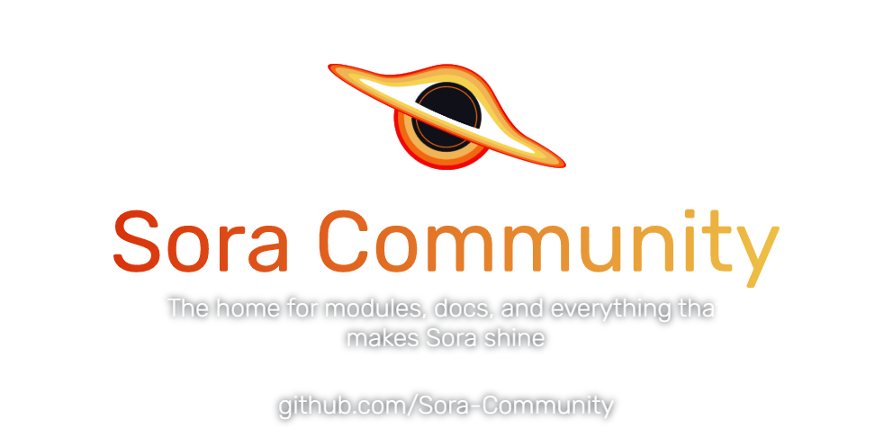

# 🌌 Sora-Community

**Sora-Community** is the collaborative home for everything related to **Sora**—a powerful, modular, and privacy-focused media player for macOS and iOS.  
We bring together developers, designers, and enthusiasts to create, document, and enhance modules that expand Sora’s capabilities.

---

## 📦 Our Projects

### [`modules`](https://github.com/Sora-Community/modules)  
A curated collection of community-driven add-ons and integrations that extend Sora’s functionality. 

### [`docs`](https://github.com/Sora-Community/docs)  
The official knowledge base for the Sora ecosystem.  
Includes onboarding guides, module development standards, API references, and best practices.

### [`Sora` (Core App)](https://github.com/cranci1/Sora)  
The heart of the ecosystem—a modular media player with:
- JavaScript-based module system
- HLS/MP4 playback
- Media server integration (Plex, Jellyfin, etc.)
- Metadata providers & tracking support
- Picture-in-Picture & external player support  
Built with ❤️ for macOS (12+) and iOS (15+), licensed under GPL-3.0.

---

## 🚀 Why Join Us?

- **Open Source** – Transparent, community-driven, and GPL-licensed.
- **Extensible** – Build and share your own modules with zero gatekeeping.
- **Cross-Platform** – Enjoy a consistent experience on macOS and iOS.
- **Privacy First** – No data harvesting, no ads—ever.

---

## 🛠 Getting Started

1. **Explore the Core App**  
   Learn more about Sora’s features and how to install it: [Sora on GitHub](https://github.com/cranci1/Sora)

2. **Browse or Submit Modules**  
   Discover existing modules in [`modules`](https://github.com/Sora-Community/modules) or create your own.

3. **Read the Documentation**  
   Visit [`docs`](https://github.com/Sora-Community/docs) for step-by-step guides and developer resources.

4. **Contribute**  
   - Fork the relevant repository  
   - Implement your feature, fix, or documentation update  
   - Submit a pull request following our contribution guidelines

---

## 🗂 Repository Overview

| Repository                                      | Purpose                                                     |
|-------------------------------------------------|-------------------------------------------------------------|
| [modules](https://github.com/Sora-Community/modules) | Community-built extensions and integrations                 |
| [docs](https://github.com/Sora-Community/docs)       | Official documentation, guides, and standards               |
| [Sora](https://github.com/cranci1/Sora)              | Core media player for macOS and iOS (GPL-3.0, modular design) |

---

## 📜 Community Guidelines

- **Respect Licensing** – All contributions must comply with the stated licenses
- **Privacy Matters** – No tracking, no ads; keep modules user-respectful.  
- **Stay Legal** – Sora doesn’t host or distribute content—ensure compliance.  
- **Document Your Work** – Every module should have clear instructions and usage notes.

---

## 💬 Join the Community

Whether you’re here to **code**, **document**, or **explore**, you’re part of the Sora journey.  
Let’s build a flexible, privacy-friendly, and beautiful media experience—together.

> [Discord](https://go.jm26.net/sora-discord)

---
